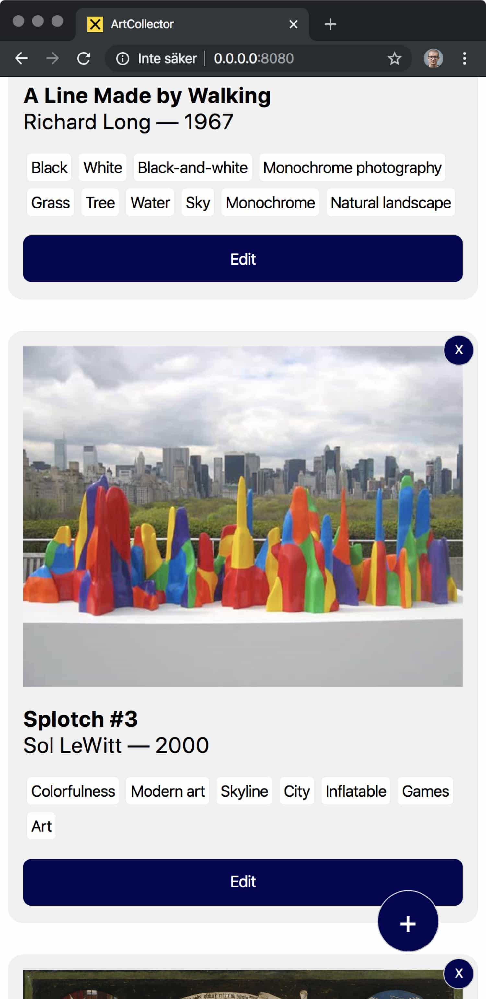

# ArtCollector frontend

This is a demo app showcasing various serverless technologies, acting together to present the user with a simple application. The frontend uses React 16, Webpack 4, Styled Components 4, Firebase authentication and the simple, native Fetch() command to do calls to a GraphQL API.

I made this app to learn more about certain aspects I've not done so much in the three big clouds (GCP, Azure, AWS), as well as to give some backing to a course I'm doing called [Cloud Developer Basics](https://medium.com/wearehumblebee/what-is-the-cloud-59a435cf384d).

This repository is based around GCP, or Google Cloud Platform.

**Make sure to reload after uploading an artwork, there is not yet a way to poll/subscribe to a fully successful write event**.

## What it is

In ArtCollector you log in (right now using Google Firebase Authentication but I will likely add support for an AWS stack and an Azure stack soon) and can then proceed to adding artworks you enjoy to a database of your own references. Note that the authentication is "naive" and that you are required to log in and that the backend will check for the existence of an non-empty parameter, but that the auth is pretty much only client-side in this demo.

The application itself is not the showcase and contains a few small trivial bugs, contains no tests, and you should add some additional validation and polish before putting this to production if that's what you really want.

## Architecture

No map for now, sorry, but I have a short description below. The big components are these:

- Frontend (this repo) based on [minimal-useful-react-pwa](https://github.com/mikaelvesavuori/minimal-useful-react-pwa), a PWA starter I've written
- [Backend API](https://github.com/mikaelvesavuori/artcollector-backend-gcp) which is the GraphQL API that does the CRUD operations you'll find referenced in the frontend
- [Image labeling service](https://github.com/mikaelvesavuori/gcp-ml-image-labeling-service), an independent micro-service (called from the API) that checks your image URL and sends back labels for it

### Frontend architecture

Fairly pared-down and mainstream, I hope. It's based around `components` for small units, `compositions` for the few bigger bits, and `containers` for the one grand view that exists. You'll find `queries` to contain just that: the functions that create our GraphQL queries. Anything functional and disassociated from state is in `helpers`.

There's no `apollo-boost` or `apollo-client`, just native Fetch for doing AJAX. State management is traditional local state.

Don't expect that I have `react-helmet` or anything fancy set up here, but I did keep the templates for PWA splash screens. If you want to roll your own solution on top of this, you'll have to do most of the polish work yourself.

Want to start working on the frontend? Open up `app.jsx`, that file contains most of what's going on.

## Prerequisites

- You will need a Google account to successfully sign in when using the application
- You will need to deploy the backend API and the image labeling service individually (you will need to match the frontend with the right backend stack; however right now only GCP is available – AWS and Azure should come soon)
- You will need to retrieve and configure any settings exposed in `src/configuration.js`, such as the values for your Firestore configuration and the API endpoint

## Installation

- Clone the [Backend API](https://github.com/mikaelvesavuori/artcollector-backend-gcp) and [Image labeling service](https://github.com/mikaelvesavuori/gcp-ml-image-labeling-service), and deploy them as per their respective instructions
- Clone this repo
- Run `yarn` or `npm install`
- Run `yarn dev` or `npm run dev`

## Building

- Run `yarn build` or `npm run build`
- NOTE: I am using the `cp` command from Mac/Linux, so you may need to replace the copying of _\_headers_ and _\_redirects_ somehow, on a non-Bash Windows setup (the files should normally be copied with the CopyWebpackPlugin, but this breaks the Service Worker!)
